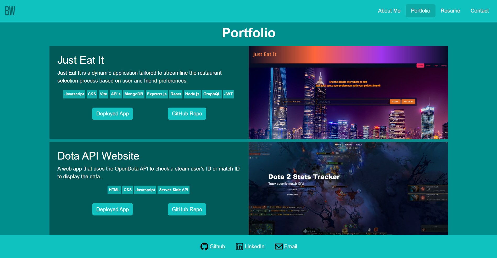
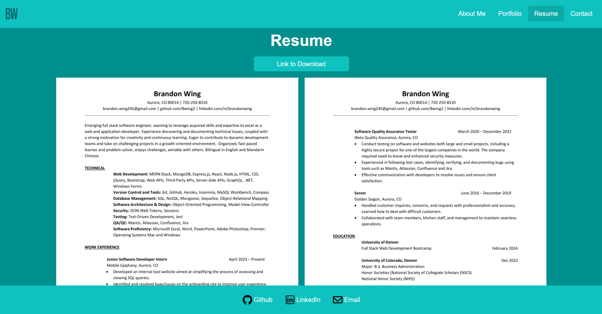

# My React Portfolio

[Live Deploy Link](https://brandon-react-portfolio.netlify.app/)

## Description

Welcome to my personal portfolio website built with React, Bootstrap, Vite, Node.js, and npm packages! The website is deployed using Netlify. This project showcases my skills, projects, about me, and contact form in a modern and responsive design.

## Table of Contents

- [Installation](#installation)
- [Usage](#usage)
- [Features](#features)
- [License](#license)
- [Questions](#questions)

## Installation

1. Clone the repository using the command `git clone https://github.com/your-username/your-portfolio.git`
2. Navigate to the project directory: `cd brandom-react-portfolio`
3. Install dependencies: `npm i`

List of all installed dependencies:

```
   bootstrap
   react
   react-dom
   react-router-dom
   @types/react
   @types/react-dom
   @vitejs/plugin-react
   eslint
   eslint-plugin-react
   eslint-plugin-react-hooks
   eslint-plugin-react-refresh
   vite
```

## Usage

Run the development server in the root terminal after installing:

```
npm start
```

There are four different sections in this application, the About Me, Portfolio, Resume, and Contact page.

### About Me Page


### Portfolio Page



### Resume Page



### Contact Page


## Features

1.  Responsive design

    Utilizing Bootstrap and custom CSS, all components are designed to maintain consistency across various screen sizes. This ensures a seamless user interface that adapts responsively to any device.

2.  React Rendering and React Router Dom

    Employing React rendering promotes a modular and reusable codebase. The integration of React Router Dom enables seamless navigation between different sections of the website without requiring page reloads, enhancing the overall user experience.

3.  Vite as a build tool

    Vite serves as an efficient build tool, accelerating development through bundling and a rapid development server. This tool enhances the speed of the development workflow, contributing to a more streamlined and productive coding experience.

## License


## Questions

You are welcome to contact me with questions using the following:

- [GitHub Profile](https://github.com/bwing2)

- [Email](mailto:brandon.wing245@gmail.com)
